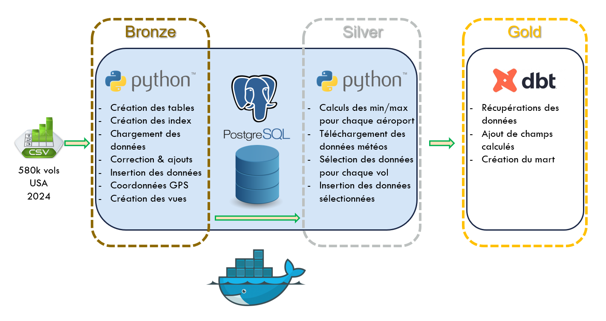
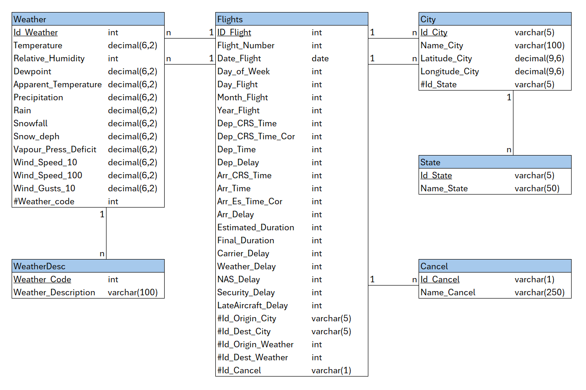
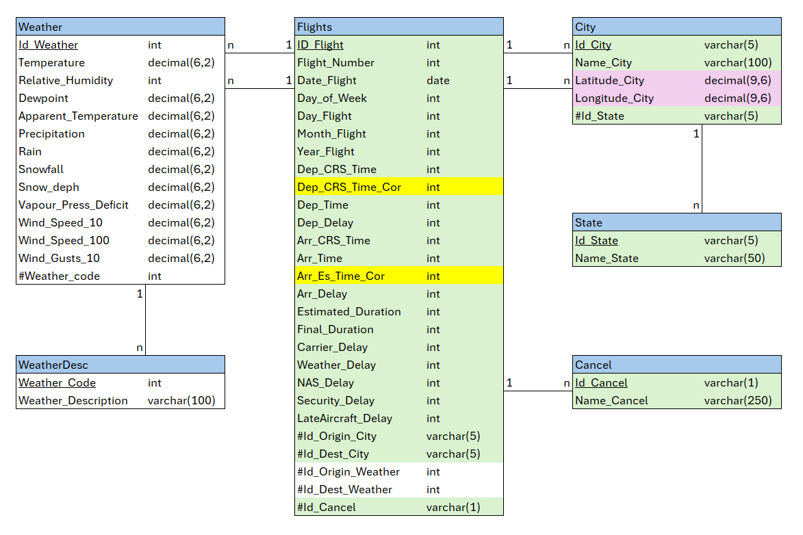
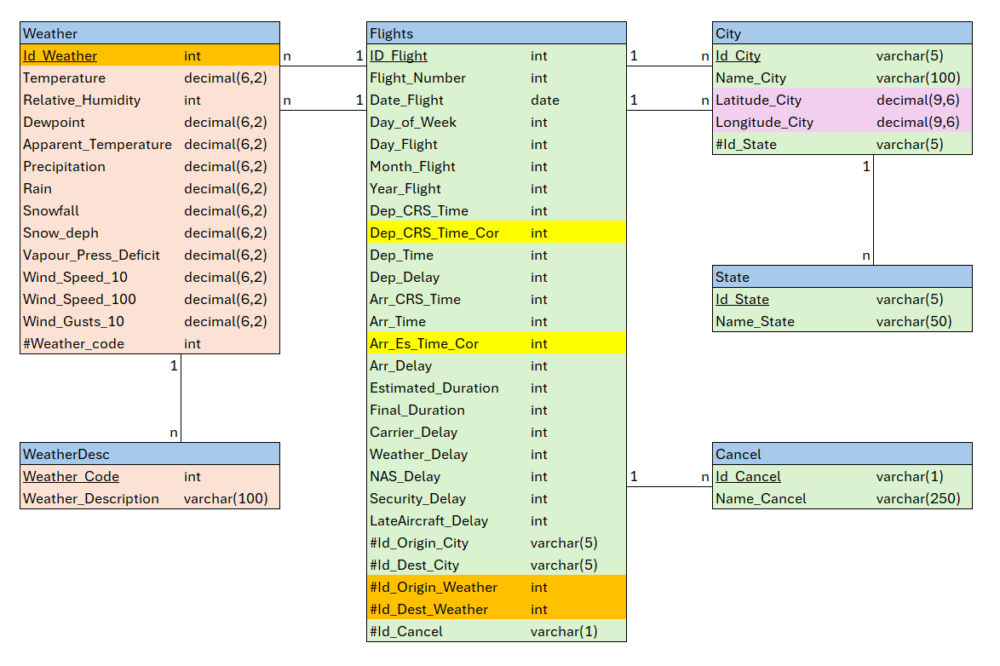

# Liora Airlines


<br/>

## Sommaire
- [Présentation](#présentation)
  - [Introduction](#introduction)
  - [MLD - Modèle Logique de Données](#mld---modèle-logique-de-données)
  - [ETL - Bronze](#etl---bronze)
  - [ETL - Silver](#etl---silver)
  - [ETL - Gold](#etl---gold)

- [Utilisation](#utilisation)
  - [Installation](#installation)
  - [Lancement](#lancement)
  - [Commandes Disponibles](#commandes-disponible)

<br/>

<br/>


## Présentation

### Introduction

<p align="justify">
Le projet Liora Airlines est le tout premier projet que j'ai réalisé en tant que Data Engineer. Ce projet a été mené, dans une équipe de 4 personnes, au cours de la formation Data Engineer que j'ai obtenue chez Liora (ex DataScientest).
<br/><br/>
L'objectif de notre travail était de prédire les retards d'avion en saisissant un vol - avec une origine et une destination - ainsi qu'une date de départ.
Nous devions initialement utiliser l'API de Lufthansa pour récupérer les données de vols. Malheureusement son utilisation a été limitée aux professionnels. Nous avons dans un premier temps essayé de trouver des API alternatives - avec une utilisation gratuite et un nombre de requetes suffissant - mais sans succès. Finalement, nous nous sommes orientés sur l'utilisation d'un dataset.
<br/><br/>
Nous avons récupéré un dataset qui recense tous les vols en retard aux USA en 2024, pour un total de 580k lignes, au format CSV. Après traitement des données, nous utiliserons 2 API d'Open-Meteo :<br/>
- Geocoding : Pour récupérer les coordonnées GPS des aéroports<br/>
- Archive : Pour récupérer les données météo a un instant T sur des coordonnées GPS, récupérées précédemment
<br/><br/>
PS : Le projet a comporté une partie Machine Learning ainsi qu'une interface web. Ma contribution a ces parties était mineure et ayant peu d'intérêt pour un Data Engineer, j'ai donc décidé de ne pas la présenter.
<br/><br/>
Voici à quoi ressemble l'architecture du projet, basée sur un modèle en médaillon :
</p>



<a href="#liora-airlines">Retour au sommaire</a>
<br/>

<br/>


### MLD - Modèle Logique de Données

<p align="justify">
Un MLD - Modèle Logique de Données, dans un SGBDR - Système de Gestion de Base de Données Relationnelle, a pour but d'optimiser au maximum l'espace de stockage - au détriment de la vitesse d'exécution - qui chute drastiquement à chaque jointure.
<br/><br/>
Pour mener à bien notre projet, voici le MLD que nous avons conçu :
</p>



Présentation des tables :
<ul>
<li align="justify"><strong>Flights</strong> : C'est la table principale. Elle regroupe les vols avec différentes données que nous avons sélectionnées dans le dataset d'origine, avec quelques champs calculés que nous avons ajoutés. Nous rentrerons dans les détails plus tard. En ID nous utilisons l'index du dataset.</li>
<li align="justify"><strong>City</strong> : Elle recense les différentes aéroports. Les ID sont les codes IATA des aéroports. Nous avons rajouté des champs latitude et longitude qui nous serviront plus tard.
Nous utilisons une double jointure entre <strong>Flights</strong> et <strong>City</strong> pour gérer l'aéroport d'origine et celui de destination grace à 2 clé étrangères disctintes dans <strong>Flights</strong> qui pointent toutes les deux sur l'ID de la table <strong>City</strong>.</li>
<li align="justify"><strong>State</strong> : Liste les différents États des USA. L'ID est le code officiel de chaque États</li>
<li align="justify"><strong>Cancel</strong> : C'est un statut d'annulation de vol (3 au total). Nous avons ajouté la valeur 0 dans le cas où le vol n'est pas annulé</li>
<li align="justify"><strong>Weather</strong> : Cette table va stocker les données météo correspondant aux coordonnées GPS des aéroports au moment du décollage et de l'atterrissage. Comme pour la table City, nous utilisons une double jointure</li>
<li align="justify"><strong>WeatherDesc</strong> : Nous utilisons une API pour récupérer les données météo. Cette API fournit une description générale de la météo avec un code, que nous stockons dans cette table</li>
</ul>

<a href="#liora-airlines">Retour au sommaire</a>
<br/>

<br/>


### ETL - Bronze

<p align="justify">
La partie Bronze commence par la création des tables dans la base de données PostgreSQL via les requêtes dans le fichier db/create_table.py.<br/>
Ensuite, nous chargons le fichier CSV dans un dataframe. Cela nous permet d'effectuer les corrections / modifications nécéssaires. Nous avons 2 champs supplémentaires, calculés grâce à des données récupérées depuis le dataset.<br/>
Une fois les modifications terminé, nous insérons les données dans les tables. Cette étape sera complété par l'utilisation d'une API de géolocalisation pour avoir les coordonnées GPS de chacun des aéroports. Ces coordonnées GPS nous servirons pour la récupération des données météos.
<br/><br/>
Voici les données qui seront inséré sur la phase bronze :
</p>



Les données qui seront inséré dans notre base PostgreSQL :
<ul>
<li align="justify"><strong>Vert</strong> : Ce sont les données récupérés depuis le dataset. Pour certains champs des corrections sont appliqués.</li>
<li align="justify"><strong>Violet</strong> : Ce sont les coordonnées GPS des aéroports qui sont récupérés via une API de géolocalisation.</li>
<li align="justify"><strong>Jaune</strong> : Ce sont des 2 champs mis en format attendu par l'API archive d'Open-Meteo. Le second plus spécifiquement est calculé pour avoir l'heure exacte où l'avion est en attente d'atterrisage au dessus de l'aéroport de destination, pour avoir les données météos qui sont la cause du potentiel retard à l'atterrisage.</li> 
</ul>

<a href="#liora-airlines">Retour au sommaire</a>
<br/>

<br/>


### ETL - Silver

<p align="justify">
La partie Silver a surtout pour but d'utiliser tout ce qui a été récupéré et préparé en phase Bronze, pour récupérer les données météos de chacun de nos vols.
<br/><br/>
Voici les données qui seront insérées sur la phase silver :
</p>



Les données qui seront inséré dans notre base PostgreSQL :
<ul>
<li align="justify"><strong>Saumon</strong> : Ce sont les données récupérés depuis l'API Open-Meteo, grace au champ calculé et aux coordonnées GPS de la phase Bronze.</li>
<li align="justify"><strong>Orange</strong> : Ce sont les ID de la table Weather. Ils sont calculés avec la logique suivante :<br/>
<pre>
- Id_Origin_Weather :<br/>
  ( Id_Flight x 2 ) - 1   => ID impairs   => données météos de décollage<br/>
- Id_Dest_Weather   :<br/>  
    Id_Flight x 2         => ID pairs     => données météos d'attérissage</li>
</pre></ul>

<a href="#liora-airlines">Retour au sommaire</a>
<br/>

<br/>


### ETL - Gold

<p align="justify">
La partie Gold, qui se déroule sur dbt, à pour but de générer un mart (table unique avec toutes les données) pour optimiser la vitesse d'execution des requetes - au détriment de l'espace de stockage - en vue d'être utilisé par un modèle de Machine Learning.
<br/><br/>
Voici comment est crée notre mart dans dbt :
</p>

```bash
with WeatherDesc as (
  select * from {{source('DatasetSilver', 'weatherdesc') }}
),

Weather as (
  select * from {{source('DatasetSilver', 'weather') }}
),

Cancel as (
  select * from {{source('DatasetSilver', 'cancel') }}
),

State as (
  select * from {{source('DatasetSilver', 'state') }}
),

City as (
  select * from {{source('DatasetSilver', 'city') }}
),

Flights as (
  select * from {{source('DatasetSilver', 'flights') }}
),

final as (
  select
    f.id_flight,
    f.flight_number,
    f.date_flight,
    f.day_of_week,
    f.day_flight,
    f.month_flight,
    f.year_flight,
    f.dep_crs_time,
    f.dep_time,
    f.dep_delay,
    f.arr_crs_time,
    f.arr_time,
    f.arr_es_time_cor,
    f.arr_delay,
    f.estimated_duration,
    f.final_duration,
    f.carrier_delay,
    f.weather_delay,
    f.nas_delay,
    f.security_delay,
    f.lateaircraft_delay,
    cl.id_cancel,
    cl.name_cancel,
    co.id_city as origin_id_city,
    co.name_city as origin_name_city,
    so.id_state as origin_id_state,
    so.name_state as origin_name_state,
    co.latitude_city as origin_latitude,
    co.longitude_city as origin_longitude,
    cd.id_city as dest_id_city,
    cd.name_city as dest_name_city,
    sd.id_state as dest_id_state,
    sd.name_state as dest_name_state,
    cd.latitude_city as dest_latitude,
    cd.longitude_city as dest_longitude,
    wo.temperature as origin_temperature,
    wo.relative_humidity as origin_relative_humidity,
    wo.dewpoint as origin_dewpoint,
    wo.apparent_temperature as origin_apparent_temperature,
    wo.precipitation as origin_precipitation,
    wo.rain as origin_rain,
    wo.snowfall as origin_snowfall,
    wo.snow_deph as origin_snow_deph,
    wo.wind_speed_10 as origin_wind_speed_10,
    wo.wind_speed_100 as origin_wind_speed_100,
    wo.wind_gusts_10 as origin_wind_gusts_10,
    dso.weather_code as origin_weather_code,
    dso.weather_description as origin_weather_description,
    wd.temperature as dest_temperature,
    wd.relative_humidity as dest_relative_humidity,
    wd.dewpoint as dest_dewpoint,
    wd.apparent_temperature as dest_apparent_temperature,
    wd.precipitation as dest_precipitation,
    wd.rain as dest_rain,
    wd.snowfall as dest_snowfall,
    wd.snow_deph as dest_snow_deph,
    wd.wind_speed_10 as dest_wind_speed_10,
    wd.wind_speed_100 as dest_wind_speed_100,
    wd.wind_gusts_10 as dest_wind_gusts_10,
    dsd.weather_code as dest_weather_code,
    dsd.weather_description as dest_weather_description
  from flights f
    left join weather wo on wo.id_weather = f.id_origin_weather
    left join weather wd on wd.id_weather = f.id_dest_weather
    left join weatherdesc dso on dso.weather_code = wo.weather_code
    left join weatherdesc dsd on dsd.weather_code = wd.weather_code
    left join city co on co.id_city = f.id_origin_city
    left join city cd on cd.id_city = f.id_dest_city
    left join state so on so.id_state = co.id_state
    left join state sd on sd.id_state = co.id_state
    left join cancel cl on cl.id_cancel = f.id_cancel
)

select * from final
```

<a href="#liora-airlines">Retour au sommaire</a>
<br/>

<br/>


## Utilisation

### Installation

#### 1. Création d'un environnement virtuel

```bash
python3 -m venv EnvAirlines
source EnvAirlines/bin/activate        # Linux / macOS
# ou
EnvAirlines\Scripts\activate           # Windows
```

#### 2. Installation des dépendances

```bash
pip install -r requirements.txt
```

<a href="#liora-airlines">Retour au sommaire</a>
<br/>

<br/>


### Lancement


#### 1. Lancement de l'infrastructure Docker
```bash
make up
```

#### 2. Lancement du pipeline complet (ETL + DBT)
```bash
make run-full
```

<a href="#liora-airlines">Retour au sommaire</a>
<br/>

<br/>


### Commandes disponible
```bash
make help

╔════════════════════════════════════════╗
║         Commandes disponibles          ║
╠════════════════════════════════════════╣
║ make up          → Lancer Docker       ║
║ make logs-db     → Voir les logs db    ║
║ make etl-bronze  → Lancer ETL Bronze   ║
║ make etl-silver  → Lancer ETL Silver   ║
║ make etl-gold    → Lancer ETL Gold     ║
║ make run-full    → Lancer ETL Full     ║
║ make clean       → Tout nettoyer       ║
╚════════════════════════════════════════╝
```

<a href="#liora-airlines">Retour au sommaire</a>